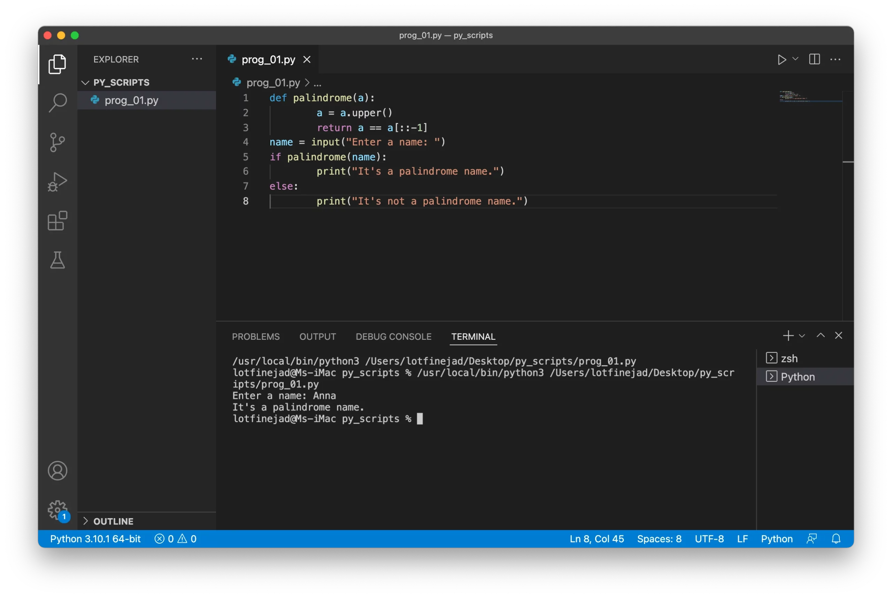
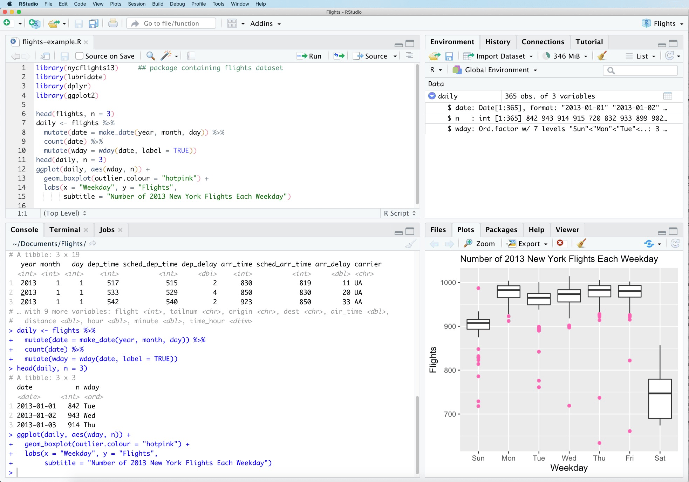
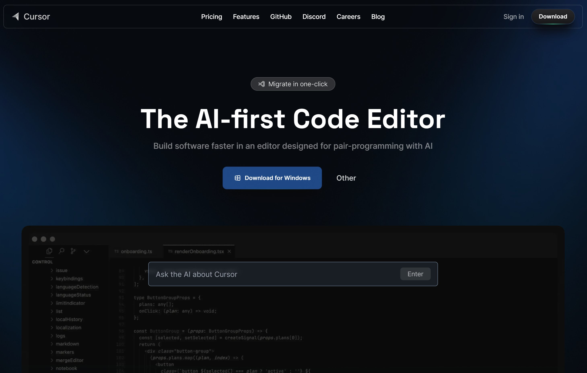
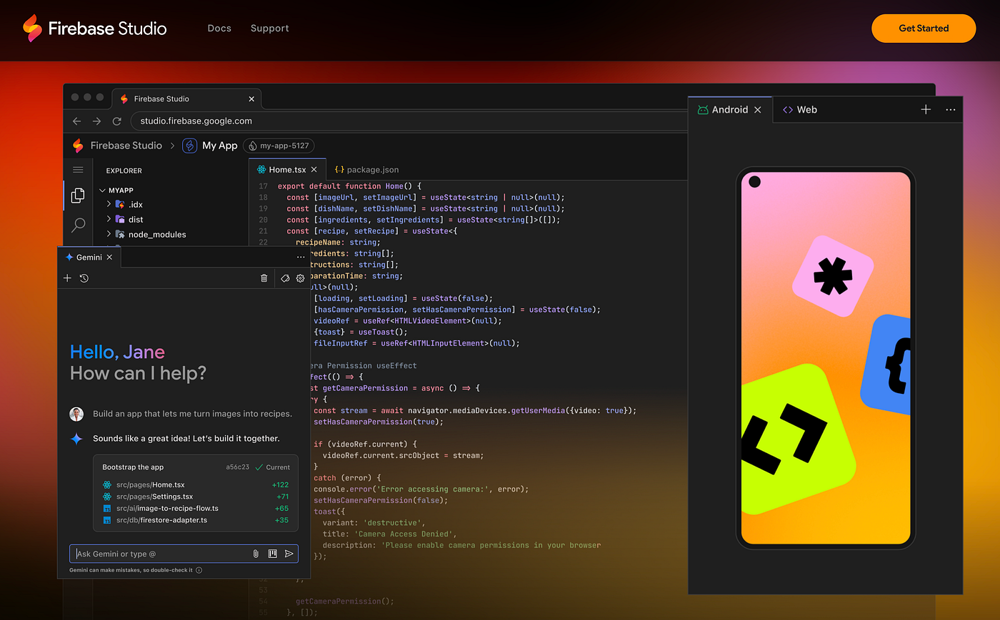

## Integrated Development Environment (IDE)

### Course date: 04 November 2025
### Last modified: 10 November 2025

### Teachers:
- [Daniel Nilsson](https://portal.research.lu.se/sv/persons/daniel-nilsson-3/)
- [Massimiliano Volpe](https://portal.research.lu.se/en/persons/massimiliano-volpe/)

---

## Integrated Development Environment (IDE)

An Integrated Development Environment (IDE) is a software application that provides comprehensive facilities for software development.

### Core Components:
- **Source Code Editor**: Syntax highlighting, auto-completion, code folding
- **Debugger**: Step through code, inspect variables, set breakpoints
- **Build Automation Tools**: Compile, run, and test code
- **Version Control Integration**: Git support for collaboration

### For Data Science:
- Interactive consoles (R/Python)
- Data visualization and plotting
- Package management
- Notebook integration

---

## Visual Studio Code

**Visual Studio Code** (VS Code) is a free, open-source IDE, popular for data science and programming.

### Key Features:
- **Extensible**: Thousands of extensions for R, Python, and other languages
- **Integrated Terminal**: Run commands directly within the editor
- **Git Integration**: Built-in version control support

### Why Use VS Code?
- Highly customizable and lightweight
- Large community and extension ecosystem
- Native support for Jupyter notebooks

Download: [code.visualstudio.com](https://code.visualstudio.com/)

---

## Positron

**Positron** is Posit's next-generation IDE for data science, supporting both R and Python.

### Key Features:
- **Multi-Language**: Native R and Python support
- **Modern Design**: Clean, fast interface
- **Performance**: Optimized for large datasets

### Why Try Positron?
- Future-proof for modern data science
- Free and open-source

Download: [positron.posit.co](https://positron.posit.co/)

---

## RStudio

**RStudio** is the leading IDE for R programming by Posit.

### Key Features:
- **R Integration**: Native support for R scripts and packages
- **Console and Viewer**: Interactive R console and built-in plot/data viewers

### Why Use RStudio?
- Comprehensive tool for R development
- Widely adopted in academia and industry
- For new users, explore Positron as a modern alternative

Download: [posit.co/download/rstudio-desktop](https://posit.co/download/rstudio-desktop/)

---

## Cursor

**Cursor** is an AI-powered code editor based on VS Code.

### Key Features:
- **AI Integration**: Built-in AI for code completion and debugging
- **VS Code Base**: Inherits all extensions and features from VS Code
- **Composer**: AI tool for generating and editing code

### Why Use Cursor?
- Accelerated coding with AI
- Familiar interface for VS Code users

Download: [cursor.sh](https://cursor.sh/)

---

## Firebase Studio

**Firebase Studio** is a web-based visual tool for Firebase apps, powered by Google Gemini.

### Key Features:
- **Visual Builder**: Drag-and-drop interface for app creation
- **No-Code**: Build apps without extensive coding knowledge

### Why Use Firebase Studio?
- Rapid prototyping and development
- AI-powered with Gemini for intelligent assistance

**Note:** Not a traditional IDE for Bioinformatics, but a no-code tool for app building.

Download: [firebase.studio](https://firebase.studio/)
